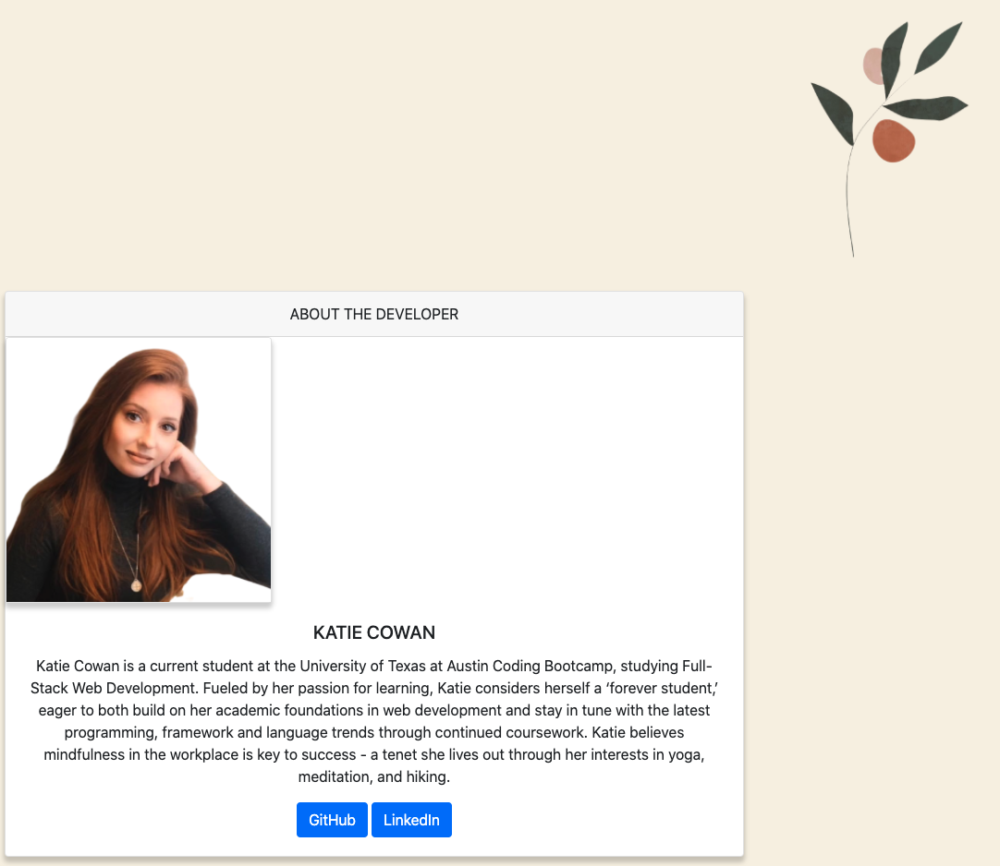
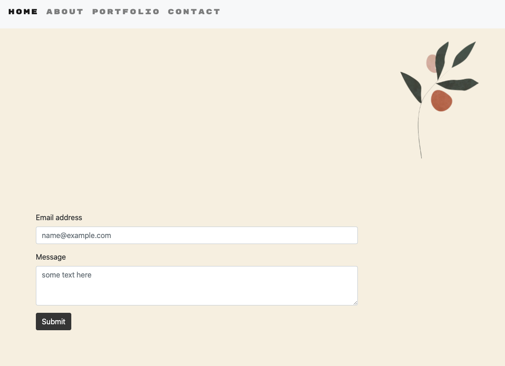
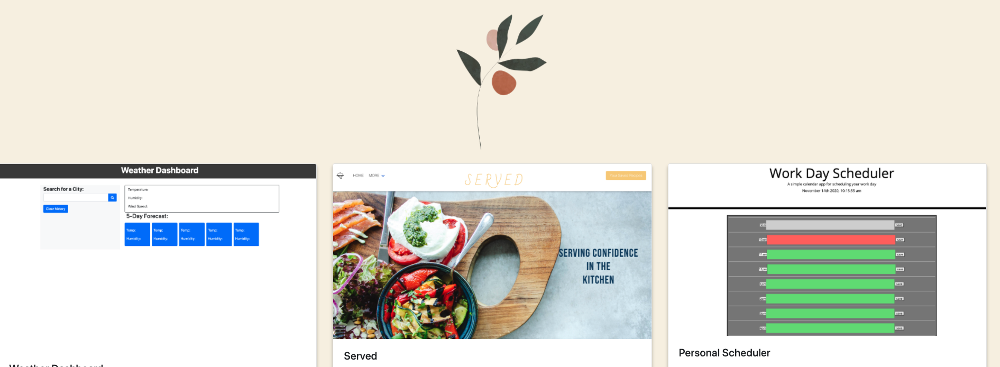

# updatedPortfolio

## Description:

This repository holds files for my personal portfolio, with updates in adding pages, contact forms, and recent projects throughout the course thus far.

## Features:

User is able to navigate throughout the website and find about me section, contact forms, portfolio pages with recent projects and a landing page.

## Links:

- GitHub Repo
  https://github.com/updatedPortfolio
- GitHub Pages
  https://ktcwn.github.io/updatedPortfolio/

## Screenshots:

- about me
  

- contact
  

- portfolio
  

## Reference:

W3 Schools
Bootstrap / Bootswatch Library
UT Bootcamp Starter Code
Dev Ed

## Contributions/Credits:

Calvin Carter (Instructor)
Study Groups // Classmates
Brennan Predemore (TA)
